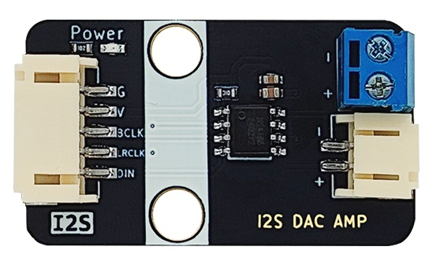
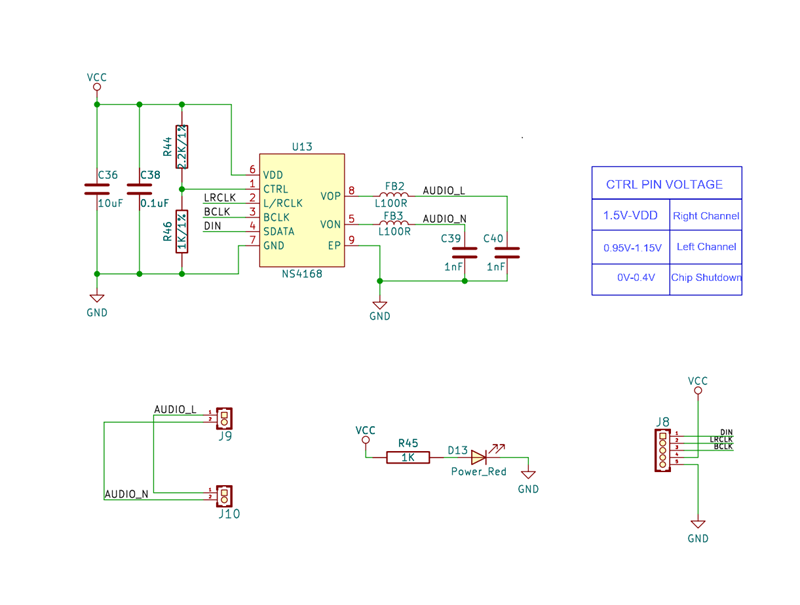
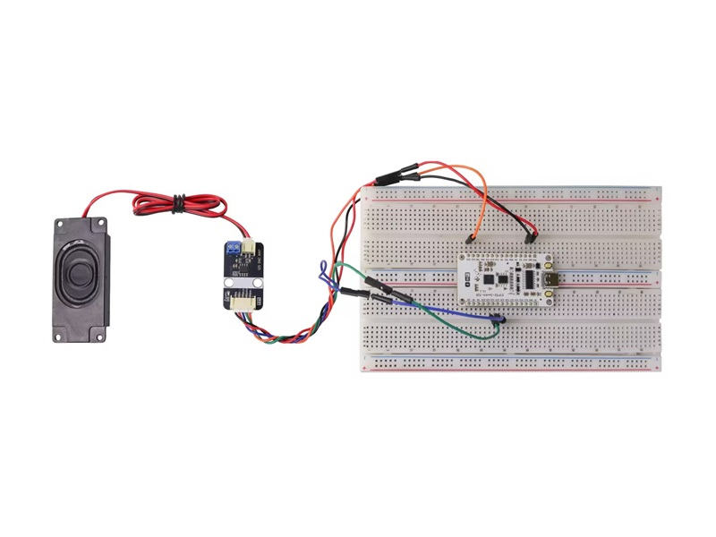
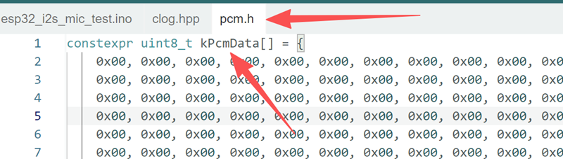

# I2S-audio-amplifier-module

Physical drawing
---------------------------------------------------------------------------------------------------------------------------------------------------------------------



Overview
----------------------------------------------------------------------------------------------------------------------------------------------------

NS4168 is a 2.5W mono Class D audio amplifier module that supports I2S digital audio signal input and has anti-distortion output, especially suitable for portable audio equipment with high power consumption and anti-interference requirements. For example, Bluetooth speaker, wifi speaker, tablet computer, and this module mainly introduces how to use it on the ESP32 series main controller. 

## Key features:

* I2S serial digital audio input interface
* Support wide range sampling rate: 8kHz~96kHz
* Automatic sample rate detection, adaptive function
* Built-in digital high-pass filter, one-line pulse sets its turning point
* The left and right channels are selectable, and the level is set via the CTRL pin
* Anti-distortion NCN function,
* Class D amplifier without filters
* Output Power: 2.5W (VDD=5V, RL=4Ω)
* Operating voltage range: 3.0V~5.5V
* 0.2%THD（VDD=5V, RL=4Ω, Po=1W）
* 80% efficiency (VDD=5V, RL=4Ω, Po=2.5W)
* Excellent "power on, power down" noise suppression
* Over-current protection, over-temperature protection, and under-voltage protection
* eSOP8 package
* Size: 38.4mm×22.4mm
* Fully compatible with the standard I2S protocol

Schematic
--------------------------------------------------------------------------------------------------------------------------------------------------------------



<a href="./NS4168_SCH.pdf" target="_blank">Schematic Click here </a>

## Chip specificationsi

[Click here to view the NS4168 datasheet](./NS4168_datasheet.pdf)

[Click here to view the CAD dimension](./NS4168_i2s_dac_amp_cad_dimension.pdf)

## Usage Examples

[Click here to view arduino source](https://app.arduino.cc/sketches/b95650e3-a989-4ea7-b21f-d8a914470fc1?view-mode=embed)

[Click here to download arduino source](https://github.com/nulllaborg/i2s_audio_amplifier_module/releases/tag/v1.0.0)

**Effect:**   Broadcast a Merry Christmas

Ensure that the ESP32 board package version is 2.0.0 or later, or set the framework version to `espressif32@>=2.0.0` in PlatformIO.

```c++
#define CLOG_PREFIX_DATE (0)
#define CLOG_PREFIX_PID (0)
#define CLOG_PREFIX_TID (0)

#include "clog.hpp"
#include "driver/gpio.h"
#include "driver/i2s_std.h"

namespace {
#include "pcm.h"
i2s_chan_handle_t g_tx_handle = 0;
}  // namespace

void setup() {
  Serial.begin(115200);
  CLOGI << "setup";

  // I2S channel config
  i2s_chan_config_t tx_chan_cfg = I2S_CHANNEL_DEFAULT_CONFIG(I2S_NUM_1, I2S_ROLE_MASTER);

  i2s_new_channel(&tx_chan_cfg, &g_tx_handle, NULL);

  // I2S config
  i2s_std_config_t tx_std_cfg = {
      .clk_cfg = I2S_STD_CLK_DEFAULT_CONFIG(16000),
      .slot_cfg = {
        .data_bit_width = I2S_DATA_BIT_WIDTH_16BIT,
        .slot_bit_width = I2S_SLOT_BIT_WIDTH_AUTO,
        .slot_mode = I2S_SLOT_MODE_MONO,
        .slot_mask = I2S_STD_SLOT_BOTH,
        .ws_width = I2S_DATA_BIT_WIDTH_16BIT,
        .ws_pol =false,
        .bit_shift = false,
        .msb_right = true,
      },
      .gpio_cfg =
          {
              .mclk = I2S_GPIO_UNUSED,
              .bclk = GPIO_NUM_33,
              .ws = GPIO_NUM_32,
              .dout = GPIO_NUM_23,
              .din = I2S_GPIO_UNUSED,
              .invert_flags =
                  {
                      .mclk_inv = false,
                      .bclk_inv = false,
                      .ws_inv = false,
                  },
          },
  };

  ESP_ERROR_CHECK(i2s_channel_init_std_mode(g_tx_handle, &tx_std_cfg));
  ESP_ERROR_CHECK(i2s_channel_enable(g_tx_handle));

  size_t bytes_written = 0;
  i2s_channel_write(g_tx_handle, kPcmData, sizeof(kPcmData), &bytes_written, 1000 * 10);

  CLOGI << "setup OK";
}

void loop() {
}
```

**Wiring diagram:**

| ESP32 | I2S Audio Amplifier Module（NS4148） |
|:-----:|:----------------------------------:|
| 3.3V  | VCC                                |
| GND   | GND                                |
| IO33  | BCLK                               |
| IO32  | LRCLK/WS                           |
| IO23  | DIN                                |



This case can only play PCM encoded arrays with a sampling rate of 16kHz and a bit depth of 16 bits, such as the pcm.h in the example, which is the audio file array for "merry christmas". The file playback size depends on the motherboard's flash size.

**How to convert the encoding?**

1. Install FFmpeg. [click to download](https://ffmpeg.org/download.html) the corresponding version.

2. Configure the FFmpeg environment variables, and then execute the following command in the CMD command line:
   
        ffmpeg -y -i input.mp3 -acodec pcm_s16le -f s16le -ac 1 -ar 16000 output.pcm
   
   **Parameter breakdown:**
   a. **`-y`**
   
       * Automatically overwrite output files without confirmation.
   
   b. **`-i input.mp3`**
   
       * Specifies the input file as `input.mp3`.
   
   c. **`-acodec pcm_s16le`**
   
       * Sets the audio codec to PCM 16-bit signed integer.
       
       * `s16le` = signed 16-bit little-endian.
   
   d. **`-f s16le`**
   
       * Forces the output format to be raw PCM (without a file header).
       
       * Consistent with the codec, ensuring output of pure audio data streams.
   
   e. **`-ac 1`**
   
       * Sets the number of audio channels to 1 (mono).
       
       * If the input is stereo, it will be downmixed to mono.
   
    f. **`-ar 16000`**
   
       * Sets the audio sampling rate to 16000Hz (16kHz).
   
    g. **`output.pcm`**
   
       * Output filename.

3. Convert the output `output.pcm` file into a C language format header file.
   It is recommended to use the xxd dump tool.
   Command: 
   
       xxd -i -C ./output.pcm pcm.h

4. Open the generated pcm.h file, replace the variable names in pcm.h with kPcmData, save the file, and replace the pcm.h in the example.Upload a case and you can play a customized audio file.
   
