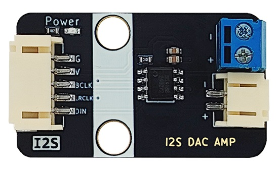
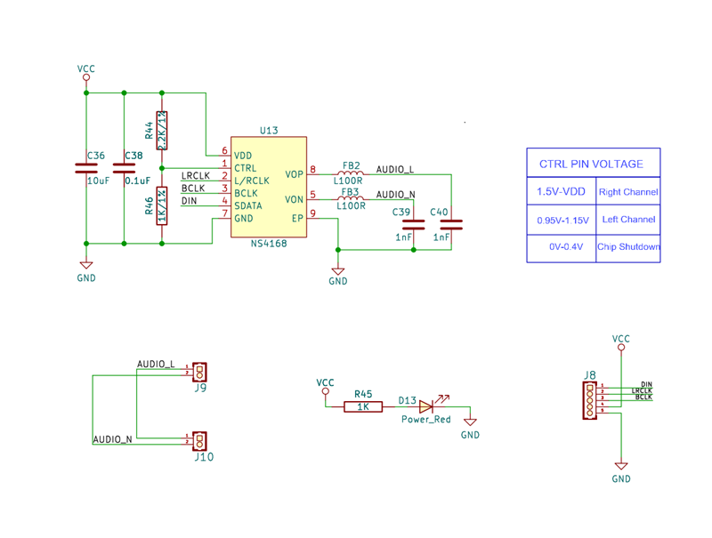

# I2S-audio-amplifier-module

Physical drawing
---------------------------------------------------------------------------------------------------------------------------------------------------------------------

Overview
----------------------------------------------------------------------------------------------------------------------------------------------------

        NS4168 is a 2.5W mono Class D audio amplifier module that supports I2S digital audio signal input and has anti-distortion output, especially suitable for portable audio equipment with high power consumption and anti-interference requirements. For example, Bluetooth speaker, wifi speaker, tablet computer, and this module mainly introduces how to use it on the ESP32 series main controller.

Key features:
---------------------------------------------------------------------------------------------------------------------------------------------------------------------------------

* I2S serial digital audio input interface
* Support wide range sampling rate: 8kHz~96kHz
* Automatic sample rate detection, adaptive function
* Built-in digital high-pass filter, one-line pulse sets its turning point
* The left and right channels are selectable, and the level is set via the CTRL pin
* Anti-distortion NCN function,
* Class D amplifier without filters
* Output Power: 2.5W (VDD=5V, RL=4Ω)
* Operating voltage range: 3.0V~5.5V
* 0.2%THD（VDD=5V, RL=4Ω, Po=1W）
* 80% efficiency (VDD=5V, RL=4Ω, Po=2.5W)
* Excellent "power on, power down" noise suppression
* Over-current protection, over-temperature protection, and under-voltage protection
* eSOP8 package

Schematic
--------------------------------------------------------------------------------------------------------------------------------------------------------------

<a href="./NS4168_SCH.pdf" target="_blank">Schematic Click here </a>

Chip specificationsi
------------------------------------------------------------------------------------------------------------------------------------------------------------------------------------------

[Click here to view the NS4168 datasheet](./NS4168_datasheet.pdf)

Usage Examples
----------------------------------------------------------------------------------------------------------------------------------------------------------------------------

[Click here to see an example of this module with an I2S mems digital microphone module](https://github.com/nulllaborg/i2s-mems-digital-microphone-module)

